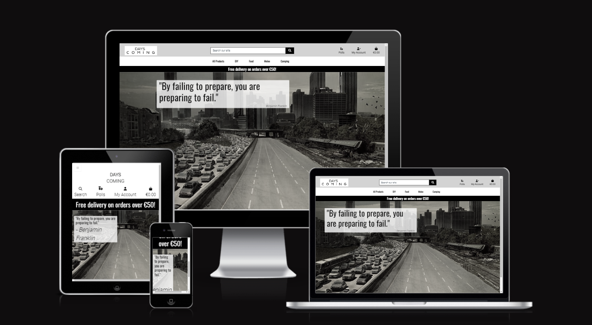
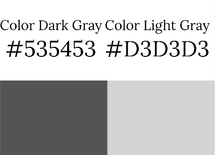
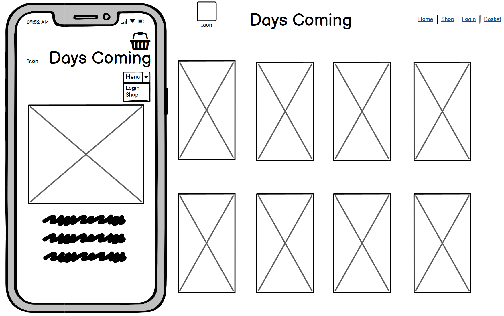
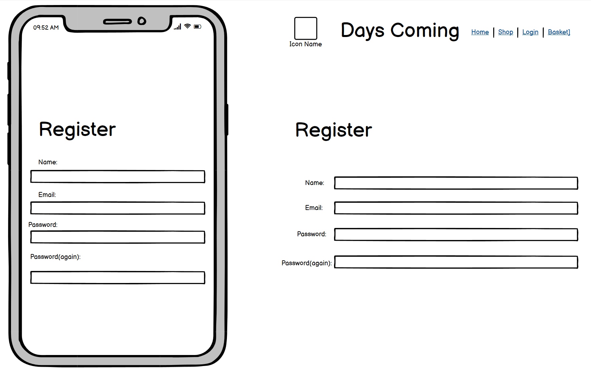
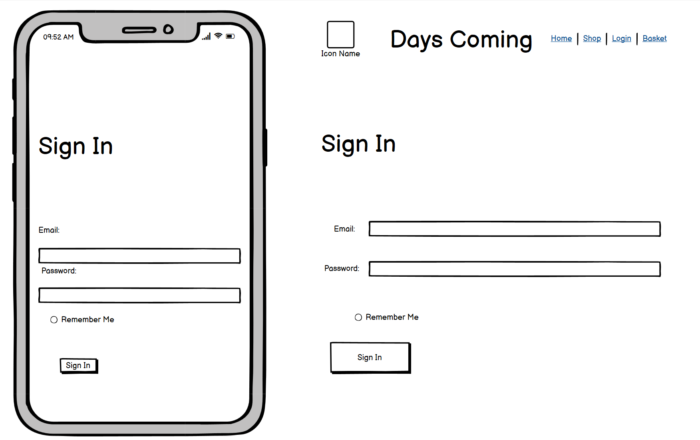
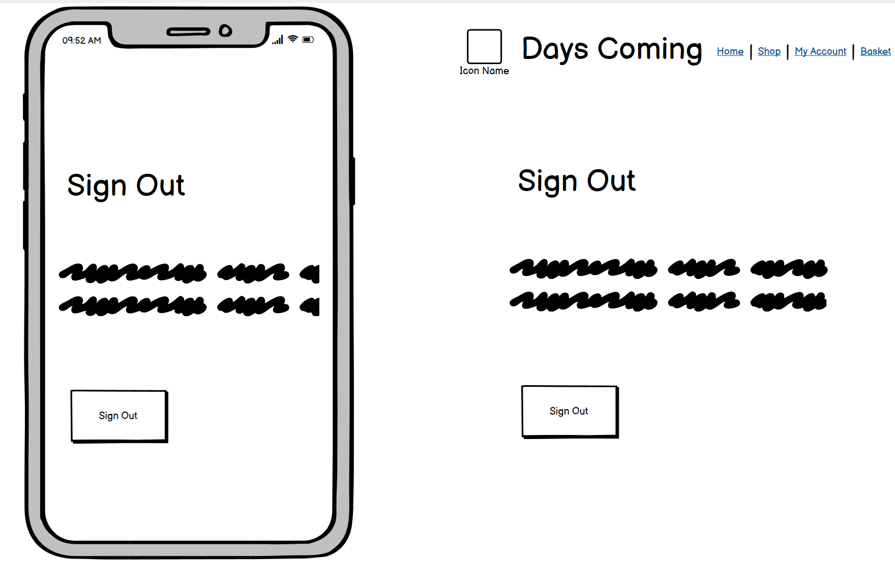
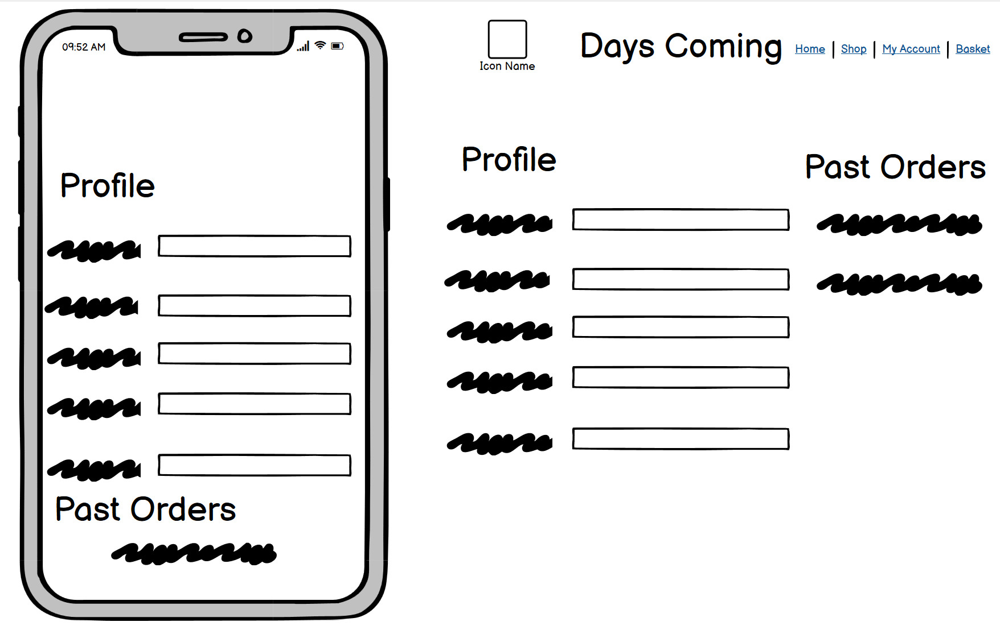
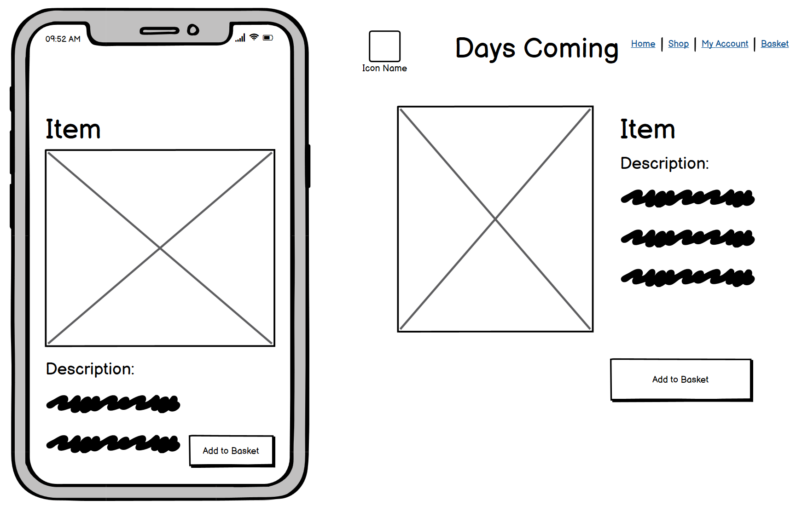
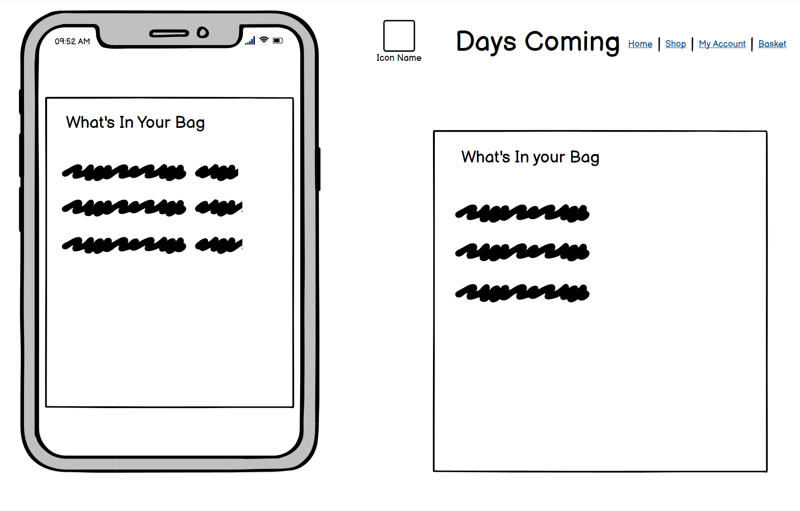
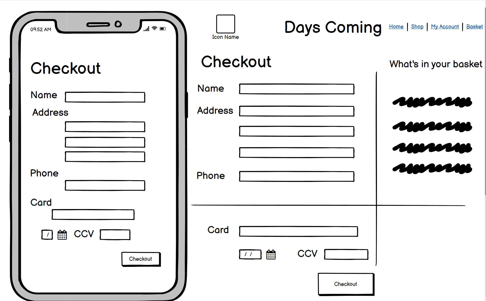

Days coming is a fictitious ecommerce full stack project built using Django, Python, JavaScript and Bootstrap 4. The site is deployed to Heroku, uses Amazon S3 for cloud storage and Stripe for payment processing. 

Days Coming is a business to consumer online retailer for apocalyptic preperation also known as [survivalism](https://en.wikipedia.org/wiki/Survivalism). The products on the site reflect the theme of survivalism such as [MRE'S](https://en.wikipedia.org/wiki/Meal,_Ready-to-Eat), and [living off the grid](https://en.wikipedia.org/wiki/Off-the-grid). 

Days coming is my 5th milestone project for Code Institute in Diploma in Software Development (E-commerce Applications).

:desktop_computer: [Live Website](https://pp5-dayscoming.herokuapp.com/)

:open_file_folder: [Github Repository](https://github.com/eleanorbucke21/PP4)

---
**TABLE OF CONTENTS**
* [USER EXPERIENCE](#user-experience)
     * [Agile](###agile)
* [User Stories](#user-stories)
* [Features](#features)
    * [Navigation](##Navigation)
    * [Header](##Header)
    * [Footer](##Footer)
    * [Register](##Register)
    * [Logout](##Logout)

* [Future Features](#ufuture-featuresu)
* [Typographyand Color Scheme](#typography-and-color-scheme)
    * [Font](##Font)
    * [Color Scheme](##color)
* [Technologies Used](#technologies-used)
    * [Languages Used](#languages-used)
    * [Frameworks Used](#frameworks-used)
    * [Databases Used](#databases-used)
    * [Libraries and Packages Used](#libraries-and-packages-used)
    * [Programmes and Applications Used](#programmes-and-applications-used)
    * [Cloud Application Platforms Used](#cloud-platforms-used)
    * [Cloud Storage Services Used](#cloud-storage-services-used)
* [Testing](#testing)
* [Bugs, Issues and Solutions](#bugs-issues-and-solutions)
* [Deployment and Local Development](#deployment-and-local-development)
    * [Deployment](#deployment)
        * [Github](#ugithubu)
        * [Gitpod](#ugitpodu)
        * [ElephantSQL](#uelephantsqlu)
        * [Heroku](#uherokuu)
* [Credits](#credits)
    * [Content](#ucontentu)
    * [Code & Tutoiral](#ucode--tutorialsu)
    * [Media](#umediau)
    * [Images Used:](#umediau)
---

 

# User Experience

### Agile

I implemented agile methodology when creating this website. The link to the project board can be found [here](https://github.com/users/eleanorbucke21/projects/11)

### User Stories

HomePage <strong><u>(Not logged in)</u></strong>

- As a user I want to be able to tell what the website is about.
- As a user I want to be able to register.
- As a user I want to be able to login. 
- As a user I want to see the products.
- As a user I want to be able to buy products.
- As a user I want to receive a confirmation notification after I have bought something.
- As a user I want to receive an email confirmation after I have bought something.
- As a user I want to be able to use the contact form.

Homepage <strong><u>(Logged in) </u></strong>
- As a user I want to be able to buy products.
- As a user I want to be able to logout.
- I want to be able to see that I am logged in via the user icon. 

Header/Navbar<strong><u>(Not logged in)</u></strong>
- I want to be able to see the website name.
- I want to be able to search in the search bar.
- I want to be able to see that I am not logged in via the user icon with an x. 

Register

- As a user I want to be able to register.
- I want to recieve a confirmation notification that I have registered.
- I want to recieve a confirmation email that I have registered.

Login Page

- As a user I want to be able to login with username and password.
- As a user I want to have the option of remembering me instead of having to login again on my browser.
- I want to recieve a notification that I have logged in.

Logout Page

- As a user I want to be able to logout.
- I want to recieve a confirmation notification that I have logged out.

Profile Page

- I want to be able to have my details saved.
- I want to be able to update my details. 
- I want to be able to see past orders.

All Products Page

- I want to be able to see the products.
- I want to be able to filter the products by price, rating &amp; category.  

All Products Page(Logged in as SuperUser/Admin)

- I want to be able to see the products.
- I want to be able to filter the products by price, rating &amp; category.  
- I want to be able to add it to my shopping bag.

Product Detail Page

- I want to be able to see the product.
- I want to see the details of the product.
- I want to be able to choose the sizes. 
- I want to be able to add it to my shopping bag.

Product Detail Page(Logged in as SuperUser/Admin)

- I want to be able to see the product.
- I want to be able to edit the product.
- I want to be able to delete the product.
- I want to see the details of the product. 

Shopping Bag Page

- I want to be able to see what's in my shopping bag.
- I want to be able to update quantity in my shopping bag.
- I want to be able to remove from my shopping bag. 

Checkout Page

- I want to be able to see what's in my bag.
- I want to be able to write in my delivery address.
- I want to be able to write in my card details securely. 

Admin Page

<i>To access the admin page type <strong>/admin</strong> at the end of the address bar</i>
- As an admin I want to be able to approve or not approve polls.
- As an admin I want to be able to view the users.
- As an admin I want to be able to review the contact forms that had been sent in.  

Contact Us Page

- As a user I want to be able to contact the admin of the site.
- As a user I want to recieve a notification that the contact form has been sent.

Polls Page <strong><u>(Not logged in)</u></strong>

- As a user I want to be able to see the polls.

Polls Page <strong><u>(Logged in)</u></strong>

- As a user I want to be able to vote.
- As a user I want to be able to see the results.
- As a user I want to be able to create a poll.
- As a user I want to be able to receive a notification that my poll is under review.

# Features 
## Navigation Bar
- Featured at the top of the page with the name of the website on the left.
- It contains the links for user account, polls and the shopping bag. 
- The navigation bar also has a register, login, my Account and logout depending on if user is logged in. 
- The navigation is also responsive to smaller screens with a toggle option on the navbar, which hides the links till tapped.

## Header
- The header shows the name of the website <i>Days Coming</i>.
- The header has a colorful background which is why I used an opac background with dark text to display the name of the website.
- The image used as the background represents what the website is about.

## Footer
- The footer has a link to facebook.
- The footer has a link to Twitter.
- The footer has a link to my github.

## Register
- The register page has a form.
- The form displays the details needed.
- If username is already in use it will ask you to fill out form again.
- Once you register you are re-directed to home page.

## Login
- The login page has a form.
- The form displays where to type name and password.
- The form also has an option to tick ✔️ remember me so they won't need to login the next time they visit the page.
- If a user enters the incorrect username they will recieve an error.

## Logout
- A user is asked if they are sure they want to logout.
- After clicking <i>signout</i> they are redirected to the home page.

## All Products Page
<u><strong>When admin is not logged in:</strong></u>
- This displays all the products.

## All Products Page
<u><strong>When admin is logged in:</strong></u>
- This displays all the products.
- Can select a product to edit.
## Product Detail
<u><strong>When user is  not logged in:</strong></u>
- The product detail page displays the description of the product.
- The product detail page displays an image of the product.
- The product detail pay displays the price. 
- The user can read the reviews below the product.

<u><strong>When user is logged in:</strong></u>
- The user can leave a review on the product.

## Bag page
- Can see what is in your bag.

## Polls Tab 
<u><strong>When user is  not logged in:</strong></u>
- The user can view the polls.

<u><strong>When user is logged in:</strong></u>
- The user can view the polls
- The user can vote in the polls.
- The user can view the results.
- The user can create a poll.

## Toasts
These are available when a user:
- Log in
- Register
- Logout
- Leave a review
- Add a product to the bag
- When order is processed
- Create a poll
- Submit the contact form
- admin edits a product
- admin adds a product

# Future Features 
- In the future I would like to enable editing reviews.
- In the future I would like to enable deleting reviews.
 

# Typography and Color Scheme

## <u>Font</u>
The fonts used in this project were:
- [Roberto](https://fonts.google.com/specimen/Roboto). This was used in the body of the project.
- [Oswald](https://fonts.google.com/specimen/Oswald). This was used on headers through out the project. 

## <u>Color Scheme</u>

The colout scheme used was:
- Dark gray #535453
- Light gray #D3D3D3

## <strong>Wireframes</strong>
### Home Page

### Registration Page

### Login Page

### Logout Page

### Profile Page

### Product Detail Page

### Shopping Bag Page

### Checkout Page

# Agile Methodology
## **GitHub Projects**

Find out project board here:
* [project board]()

GitHub Projects was used to manage the development of the site. It helped our team to break down large issues into smaller issues and how these fit into the overall goals of implementing specific features we wanted for the site. We also used labels to distinguish the issues which are part of the setup, of the documentation, the must haves and the enhancements, and the required validations.

 

# <strong>Technologies</strong>
### <u>Languages used</u>
- [HTML](https://en.wikipedia.org/wiki/HTML5) - Add content and formatting to web page.
- [CSS](https://en.wikipedia.org/wiki/CSS) - Add styling and colours to web page.
- [JavaScript](https://en.wikipedia.org/wiki/JavaScript) - Add interactive features to web page.
- [Python](https://www.python.org/) was used for the back end programming of the site.

### <u>Technologies Used</u>
- [Django](https://en.wikipedia.org/wiki/Django_(web_framework)) - A Python-based web framework that follows the model–template–views (MTV) architectural pattern. 
- [Bootstrap4 - v4.6](https://getbootstrap.com/docs/4.6/getting-started/introduction/) was used as the frontend framework.

### <u>Databases Used</u>
- [ElephantSQL](https://www.elephantsql.com/) - Also known as postgres, is a free and open-source relational database management system (RDBMS) emphasizing extensibility and SQL compliance. 
- [DB.SQLITE3](https://docs.djangoproject.com/en/4.1/ref/databases/#sqlite-notes) was the database used for the project (development).

### <u>Programmes and Applications Used</u>
- [Gitpod](https://gitpod.io/) - web-based editor optimised for debugging, testing, syntax highlighting and extension support.
- [Git](https://git-scm.com/) - used to allow for tracking of any changes in the code and for the version control.
- [Github](https://github.com/) - used to host the project files and host webpage onto the internet.
- [Heroku](https://www.heroku.com/) - A cloud platform service that supports several programming languages.
- [Fontawesome](https://fontawesome.com/) - to insert icons in the website to make site more visually appealing and easy to navigate.
- [Google Fonts](https://fonts.google.com/) - used to import fonts in the style.css stylesheet.
- [Favicon](https://favicon.io/) - to insert icons in the website to make site more visually appealing.
- [Adobe Express](https://https://www.adobe.com/express/) - Used to design the logo.
- [Abdobe Photoshop](https://www.adobe.com/ie/products/photoshop.html) - Used to style the images used.

### Libraries and Packages Used
- [django-allauth==0.41.0](https://django-allauth.readthedocs.io/en/latest/) is an integrated set of Django applications dealing with account authentication, registration, management, and third-party (social) account authentication.
- [django-countries==7.2.1](https://pypi.org/project/django-countries/7.2.1/) was the Django application used to provide country choices for use with forms, and a country field for models.
- [django-crispy-forms==1.14.0](https://pypi.org/project/django-crispy-forms/) was used to build programmatic reusable layouts out of form components.
- [django-storages==1.13.2](https://django-storages.readthedocs.io/en/latest/) - collection of custom storage backends for Django
- [django-widget-tweaks==1.4.12](https://pypi.org/project/django-widget-tweaks/)Tweak the form field rendering in templates, not in python-level form definitions. Altering CSS classes and HTML attributes is supported.
- [gunicorn==20.1.0](https://gunicorn.org/) - a Python WSGI HTTP Server that allows us to run any Python application concurrently by running multiple processes within a single dyno.
- [jmespath==1.0.1](https://jmespath.org/tutorial.html)a query language for search JSON documents
- [oauthlib==3.2.2](https://oauthlib.readthedocs.io/en/latest/)a framework which implements the logic of OAuth1 or OAuth2 without assuming a specific HTTP request object or web framework
- [Pillow==9.4.0](https://pypi.org/project/Pillow/) - a required Python imaging library used to enable handling of images.
- [psycopg2==2.9.5](https://pypi.org/project/psycopg2/) - a postgresql database adapter for python and used to connect with our postgres database.
- [requests-oauthlib==1.3.1](https://oauthlib.readthedocs.io/en/latest/)a framework which implements the logic of OAuth1 or OAuth2 without assuming a specific HTTP request object or web framework

- [stripe==5.2.0](https://stripe.com/docs?utm_campaign=paid_brand-IE_en_Search_Brand_Stripe-1615558792&utm_medium=cpc&utm_source=google&ad_content=604147516527&utm_term=stripe&utm_matchtype=e&utm_adposition=&utm_device=c&gclid=CjwKCAjwscGjBhAXEiwAswQqNAPpj1TR69CT0yDVLOlLVRuJSYLbi7hlrBKVWkFRMeDE8h4nGIM7mxoCzF8QAvD_BwE)a payment services provider that lets merchants accept credit and debit cards or other payments.

---
# **TESTING**
Please refer to [TESTING.md](./TESTING.md) file for:
* Automated Testing and Validation Results
* Manual Testing and Results

 

---
# **BUGS, ISSUES AND SOLUTIONS**
Please also refer to [TESTING.md](./TESTING.md) file for:
* Solutions to bugs found during testing and development phase
* Known bugs
 

---
# **DEPLOYMENT**
Please refer to [DEPLOYMENT.md](./DEPLOYMENT.md) file for:
* Creating the database to be used in production
* Deploying to Heroku
* Setting up AmazonS3 for hosting our static and media files
---

## <strong>Credits</strong>

- Credit to [Code Institute's](https://codeinstitute.net/) Boutique Ado walkthrough
- Credit to the class of LC-ETB Coding Careers for Women with helping when I was stuck.

### <u>Content</u>

### <u>Code & Tutorials</u>

[CREATING A POLL APP IN DJANGO](https://prettyprinted.com/tutorials/creating-a-poll-app-in-django/)

### <u>Media</u>

<strong><u>Images Used:</u></strong>

<u>Background Images</u>

- DaysComing.png created in [Adobe Express](https://https://www.adobe.com/express/).

- [LOUgrocery.png](https://www.artstation.com/artwork/mDDV8Y) Edited in Adobe Photoshop. 

- [TWD.png](https://www.google.com/url?sa=i&url=https%3A%2F%2Fwww.wallpaperflare.com%2Fcar-city-destruction-road-the-walking-dead-wallpaper-bntiu&psig=AOvVaw1V13uFa9s2Sk_iFQ-gHhVL&ust=1681290834624000&source=images&cd=vfe&ved=0CBEQjRxqFwoTCMC7jcq-of4CFQAAAAAdAAAAABAE) Edited in Adobe Photoshop. 

- [apoc-cityBW.png](https://images.adsttc.com/media/images/6419/372c/bf9a/f501/70e9/6c60/newsletter/architecture-after-civilization-design-in-the-post-apocalypse_4.jpg?1679374132) Edited in Adobe Photoshop.

- [city-overgrown-apoc.jpg](https://www.google.com/url?sa=i&url=https%3A%2F%2Fwww.pxfuel.com%2Fen%2Fdesktop-wallpaper-cldup&psig=AOvVaw0Vy8TIR0xKdTAqIH3d8ug4&ust=1683034596675000&source=images&cd=vfe&ved=0CBMQjhxqFwoTCOi8wsye1P4CFQAAAAAdAAAAABAI) Edited in Adobe Photoshop. 

- [swamp-city-apoc.png](https://cdna.artstation.com/p/assets/images/images/054/294/900/large/suresh-karunakaran-asset.jpg?1664215405) Edited in Adobe Photoshop.

- [errorzombie.png](https://www.google.com/url?sa=i&url=https%3A%2F%2Fscienceofparkinsons.com%2Ftag%2Fwhite-zombie%2F&psig=AOvVaw0vVq4QaXO9HLMY3O0UExHB&ust=1685040378320000&source=images&cd=vfe&ved=0CBEQjRxqFwoTCOiVpNvOjv8CFQAAAAAdAAAAABAJ)

<u>Product Images</u>
- [12-Halal.jpg](https://de.homeloft.eu/products/xmre-halal-1000-meals-ready-to-eat-mre-military-grade-ration-extended-shelf-life-no-refrigeration-for-law-enforcement-emergency-food-supply-outdoor-enthusiasts-12-meals-6-menus-usa-made).

- [12-Kosher-Mre's-with-heaters.jpg](https://www.amazon.com/XMRE-Kosher-Meals-Ready-Refrigeration/dp/B087D6Q5G6)

- [12-MRE's-with-heaters.jpg]()

- [book1.jpg](https://www.amazon.co.uk/Preppers-Long-Term-Survival-Guide-Grid/dp/1612432735/ref=asc_df_1612432735/?tag=googshopuk-21&linkCode=df0&hvadid=310834580283&hvpos=&hvnetw=g&hvrand=3955009589656556194&hvpone=&hvptwo=&hvqmt=&hvdev=c&hvdvcmdl=&hvlocint=&hvlocphy=1007880&hvtargid=pla-432398661566&psc=1&th=1&psc=1)

- [book2.jpg](https://www.amazon.co.uk/New-Complete-Book-Self-Sufficiency-Realists/dp/0241352460/ref=asc_df_0241352460/?tag=googshopuk-21&linkCode=df0&hvadid=310817437803&hvpos=&hvnetw=g&hvrand=3955009589656556194&hvpone=&hvptwo=&hvqmt=&hvdev=c&hvdvcmdl=&hvlocint=&hvlocphy=1007880&hvtargid=pla-555275467120&psc=1)

- [book3.jpg](https://www.lowplexbooks.com/products/bear-grylls-survival-skills-handbook-collection-series-10-books-collection-set?variant=31205394219098&currency=EUR&utm_source=google&utm_medium=cpc&utm_campaign=google+shopping)

- [book4.jpg](https://www.amazon.co.uk/Step-Step-Projects-Self-Sufficiency-Edibles/dp/159186688X/ref=asc_df_159186688X/?tag=googshopuk-21&linkCode=df0&hvadid=310977283160&hvpos=&hvnetw=g&hvrand=9012099597391996282&hvpone=&hvptwo=&hvqmt=&hvdev=c&hvdvcmdl=&hvlocint=&hvlocphy=1007880&hvtargid=pla-491799985424&psc=1&th=1&psc=1 )

- [book5.jpg](https://www.amazon.co.uk/Irelands-Hidden-Medicine-exploration-indigenous/dp/1913504972/ref=asc_df_1913504972/?tag=googshopuk-21&linkCode=df0&hvadid=535918752477&hvpos=&hvnetw=g&hvrand=1150682498680992184&hvpone=&hvptwo=&hvqmt=&hvdev=c&hvdvcmdl=&hvlocint=&hvlocphy=1007880&hvtargid=pla-1422958457022&psc=1&th=1&psc=1)

- [book6.jpg](https://www.amazon.co.uk/Handmade-Apothecary-Healing-herbal-recipes/dp/0857833731/ref=asc_df_0857833731/?tag=googshopuk-21&linkCode=df0&hvadid=310805565966&hvpos=&hvnetw=g&hvrand=1150682498680992184&hvpone=&hvptwo=&hvqmt=&hvdev=c&hvdvcmdl=&hvlocint=&hvlocphy=1007880&hvtargid=pla-418652487118&psc=1&th=1&psc=1)

- [british.jpg](https://www.ebay.co.uk/itm/303999142316?mkevt=1&mkcid=1&mkrid=710-53481-19255-0&campid=5338956840&toolid=10049&customid=777_777_777)

- [chickenwire.jpg](https://www.amazon.co.uk/MARKSMAN-Galvanised-HEXAGONAL-Quality-Chicken/dp/B09FZFKSSC/ref=asc_df_B09FZFKSSC/?tag=googshopuk-21&linkCode=df0&hvadid=606415632891&hvpos=&hvnetw=g&hvrand=4984429145861041103&hvpone=&hvptwo=&hvqmt=&hvdev=c&hvdvcmdl=&hvlocint=&hvlocphy=1007880&hvtargid=pla-1729484606159&psc=1)

- [cricketbat.jpg](https://edsports.ie/shop/cricket-shop/cricket-bats/kookaburra-beast-9-1-cricket-bat/)

- [crossbow.jpg](https://www.ebay.co.uk/itm/255921005855?mkevt=1&mkcid=1&mkrid=710-53481-19255-0&campid=5338956842&toolid=10049&customid=777_777_777)

- [firstaid.jpg](https://www.firstaidshop.ie/Elite-Waist-Bag-p/elitewaistbag.htm)

- [garden1.jpg](https://www.amazon.co.uk/Grand-Vegetable-Seed-Growing-Biodegradable/dp/B07YSNBNQS/ref=asc_df_B07YSNBNQS/?tag=googshopuk-21&linkCode=df0&hvadid=399666076754&hvpos=&hvnetw=g&hvrand=13773112990152098504&hvpone=&hvptwo=&hvqmt=&hvdev=c&hvdvcmdl=&hvlocint=&hvlocphy=1007880&hvtargid=pla-842704726239&psc=1&tag=&ref=&adgrpid=84809710723&hvpone=&hvptwo=&hvadid=399666076754&hvpos=&hvnetw=g&hvrand=13773112990152098504&hvqmt=&hvdev=c&hvdvcmdl=&hvlocint=&hvlocphy=1007880&hvtargid=pla-842704726239)

- [garden2.jpg](https://www.amazon.co.uk/Kitchen-Herb-Seed-Set-Varieties/dp/B082YBWQ2Z/ref=asc_df_B082YBWQ2Z/?tag=googshopuk-21&linkCode=df0&hvadid=399666076754&hvpos=&hvnetw=g&hvrand=13773112990152098504&hvpone=&hvptwo=&hvqmt=&hvdev=c&hvdvcmdl=&hvlocint=&hvlocphy=1007880&hvtargid=pla-859115129016&psc=1&tag=&ref=&adgrpid=84809710723&hvpone=&hvptwo=&hvadid=399666076754&hvpos=&hvnetw=g&hvrand=13773112990152098504&hvqmt=&hvdev=c&hvdvcmdl=&hvlocint=&hvlocphy=1007880&hvtargid=pla-859115129016)

- [halal22.png](https://www.mre-empire.com/products/usa-halal-mre-military-meal-ready-to-eat-ration)

- [halalchick.png](https://www.ebay.com/itm/203285573917)

- [headgear1.jpg](https://www.amazon.co.uk/Oregon-Q515061-Combination-Trimmer-Brushcutting/dp/B007KJMNCM/ref=asc_df_B007KJMNCM/?tag=googshopuk-21&linkCode=df0&hvadid=217947492190&hvpos=&hvnetw=g&hvrand=13709334112229584797&hvpone=&hvptwo=&hvqmt=&hvdev=c&hvdvcmdl=&hvlocint=&hvlocphy=1007880&hvtargid=pla-422177074713&th=1)

- [hurley.jpg](https://www.elverys.ie/Elverys/GAA/Hurling/Hurleys/Reydon-Uwin-Hurley-34in-Multi/p/000000000001124554?gclid=CjwKCAjw8-OhBhB5EiwADyoY1czyFnSIzkGbJ7R1t5GQb0zJ3b9z4iqsTCXIGPBCWogqYF0yOIdtlBoCtiUQAvD_BwE)

- [kosherweek.jpg](https://www.ebay.co.uk/itm/144085547640?mkevt=1&mkcid=1&mkrid=710-53481-19255-0&campid=5338956840&toolid=10049&customid=777_777_777)

- [lucielle.jpg](https://www.google.com/search?q=lucille+baseball+bat&sxsrf=APwXEdeFa_GiQxYy_66JfHFJtAv7Vyun6A:1680975459054&source=lnms&tbm=shop&sa=X&ved=2ahUKEwjQsPPI6Zr-AhXWQEEAHYPuCnsQ_AUoAXoECAEQAw&biw=1478&bih=691&dpr=1.3#spd=18027295557628744709)

- [metalbaseball.jpg](https://www.amazon.co.uk/Unibos-Aluminium-Baseball-Anti-Slip-Lightweight/dp/B0BC8QWHG5/ref=asc_df_B0BC8QWHG5/?tag=googshopuk-21&linkCode=df0&hvadid=622397534057&hvpos=&hvnetw=g&hvrand=9291461595005078971&hvpone=&hvptwo=&hvqmt=&hvdev=c&hvdvcmdl=&hvlocint=&hvlocphy=1007880&hvtargid=pla-1765888545499&th=1)

- [sleepingbag1.jpg](https://www.amazon.co.uk/SOULOUT-Sleeping-Weather-Lightweight-Waterproof/dp/B07HBZCSR8/ref=asc_df_B07HBZCSR8/?tag=googshopuk-21&linkCode=df0&hvadid=309952946065&hvpos=&hvnetw=g&hvrand=15399038520547434821&hvpone=&hvptwo=&hvqmt=&hvdev=c&hvdvcmdl=&hvlocint=&hvlocphy=1007880&hvtargid=pla-595785524795&th=1)

- [sleepingbag2.jpg](https://www.ebay.co.uk/itm/144841253716?mkevt=1&mkcid=1&mkrid=710-53481-19255-0&campid=5338956843&toolid=10049&customid=777_777_777)

- [sleepingbag3.jpg](https://www.amazon.co.uk/Andes-Nevado-Season-Camping-Sleeping/dp/B00D7CNLAY?source=ps-sl-shoppingads-lpcontext&ref_=fplfs&smid=A20UFIL7MHKG1J&th=1)

- [tent1.png](https://www.greatoutdoors.ie/products/the-north-face-stormbreak-2-backpacking-tent)

- [tent2.png](https://www.halfords.ie/motoring/camping-and-leisure/tents/halfords-premium-6-person-vis-a-vis-tent-506150.html)

- [tent3.jpg](https://www.decathlon.ie/2-3-man-tents/303295-61580-mh100-camping-tent-2-man.html?srsltid=AfAwrE7B4Ag8thGKKNpj1Wgw3unAoRwJo-j8CRlV2ujjLGMErOPelMXT66I#/demodelsize-254no_size/demodelcolor-8513471)

- [usration.png](https://www.ninelife.ie/products/genuine-military-mre-meal-with-inspection-date-september-2017-or-newer-bbq-shredded-beef?gclid=CjwKCAjw8-OhBhB5EiwADyoY1Wu3ol7xW21VswTP5w1tNnOvY2qTr7PVmVXmlh4EGPbOm-WdbD99OhoC6EUQAvD_BwE)
