## TABLE OF CONTENTS

* [Automated Testing and Validation](#automated-testing-and-validation)
    * [HTML Validation](#html-validation)
    * [CSS Validation](#css-validation)
    * [JavaScript Validation](#javascript-validation)
    * [Python Validation](#python-validation)
    * [Lighthouse Report](#lighthouse-report)
        * [Desktop](#desktop)
        * [Mobile](#mobile)
    * [Responsiveness](#responsiveness) 
* [Manual Testing](#manual-testing)
    * [Test Cases](#test-cases)
    * [Full Testing](#full-testing)
* [Bugs, Errors & Solutions](#bugs-found-during-testing-and-development-phase)
    * [Solved Bugs](#solved-bugs)

---

## <strong>Testing</strong>
- [W3C Markup Validation Serice](https://validator.w3.org/) was used to test for error codes in the HTML.
- [W3C CSS Validator](https://jigsaw.w3.org/css-validator/)  was used to test for error codes in the CSS.
- [CI Python Linter](https://pep8ci.herokuapp.com/) was used to detect errors and potential problems in Python code.
- [JsHint](https://jshint.com/) was used to detect errors and potential problems in JavaScript code.
- [Chrome DevTools](https://developer.chrome.com/docs/devtools/)
    was used during the development process to test, debug, explore and modify HTML elements, and to test responsiveness in different screen sizes.
- [Lighthouse](https://developer.chrome.com/docs/lighthouse/overview/) was used for improving the quality of web page. It has audits for performance, accessibility, progressive web apps, SEO, and more.

## Automated Testing and Validation
### HTML Validation
We used [W3C Markup Validation Service](https://validator.w3.org/) to validate all the HTML files by direct input:
|Page |Pass/Fail | images |
| ------------- | ------------- |------------- |
| Index | :heavy_check_mark: |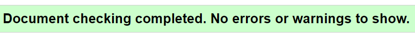  |
| Register |:heavy_check_mark: |  |
| Login |:heavy_check_mark: | |
| Logout |:heavy_check_mark: | |
| Profile |:heavy_check_mark: | |
| All Products|:heavy_check_mark: | |
|Product Detail |:heavy_check_mark: | |
|Add Product (admin) |:heavy_check_mark: | |
| Edit Product (admin) |:heavy_check_mark: | |
| Shopping Bag |:heavy_check_mark: | |
| Checkout |:heavy_check_mark: | |
| Order Success |:heavy_check_mark: | |
|Contact Us|:heavy_check_mark: | |
|Poll|:heavy_check_mark: | |
|Poll Success|:heavy_check_mark: | |
|Poll Result|:heavy_check_mark: | |
|Poll Create |:heavy_check_mark: | |

### CSS Validation
We used [W3C CSS Validation Service](https://jigsaw.w3.org/css-validator/) to validate all CSS files by direct input.

|Page | Mobile  | Computer|
| ------------- | ------------- |------------- |
| static/base.css | :heavy_check_mark: | |
| profile/static/css/base.css | :heavy_check_mark: | |
 

### JavaScript Validation
We used [JSHint](https://jshint.com/) to validate all JavaScript and JQuery files

| Page | Result | Test Details & Screenshots |
| ---- | :-: | -------------------------- |
| templates/includes/footer.html |  2 warnings  | 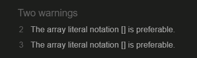 |
| bag/templates/bag/bag.html |  3 warnings  | 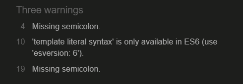 |
| products/templates/products/add_product.html |  1 warning  | 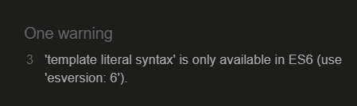 |
| products/templates/products/products.html |  3 warnings  | 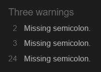 |
| products/templates/products/includes/quantity_input_script.html |  3 warnings  | 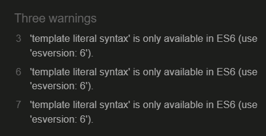 |
| templates/allauth/account/email.html |  2 warnings  | 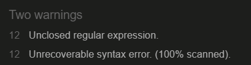 |

 

### Python Validation
At the project inception, we installed [PyCodeStyle](https://pycodestyle.pycqa.org/en/latest/intro.html#configuration) in our workspace fixed errors when encountered throughout the development process. We also used [Code Institute's Python Linter](https://pep8ci.herokuapp.com/) to lint our Python code.

| Application | Pass | Images |
| ------------- | ------------- |------------- |
| Bag |:heavy_check_mark: | 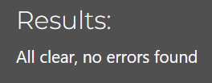 |
| Checkout |:heavy_check_mark: |  |
| Contact |:heavy_check_mark: |  |
| DaysComing |:heavy_check_mark: |  |
| Home | :heavy_check_mark: |  |
| Polls | :heavy_check_mark: |  |
| Products| :heavy_check_mark: |  |
| Profiles | :heavy_check_mark: | |

 

## <u>Lighthouse</u>
|Page | Mobile  | Computer|
| ------------- | ------------- |------------- |
| Index |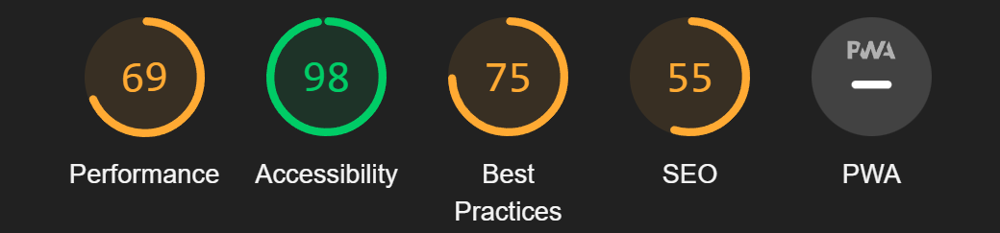 ||
| Register |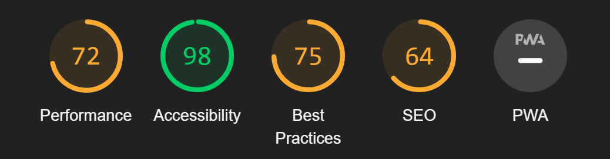  | |
| Login |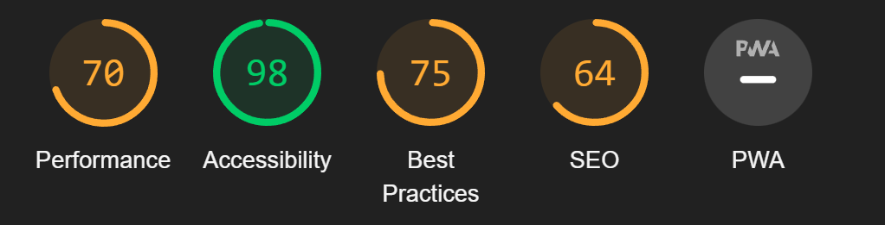  ||
| Logout |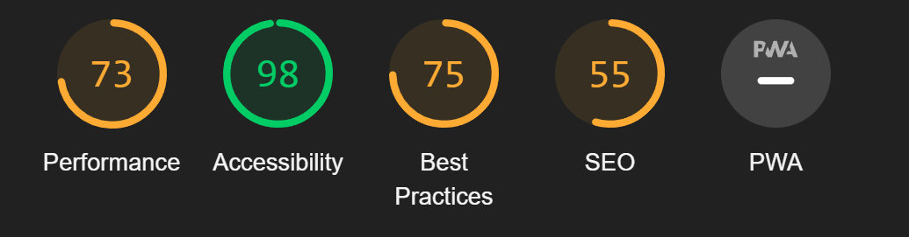  ||
| Profile | 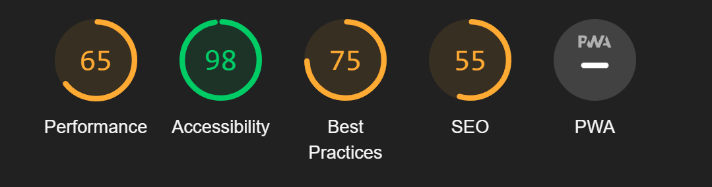 |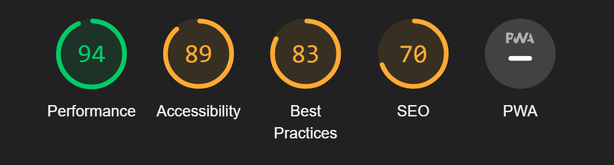|
| All Products|  ||
|Product Detail |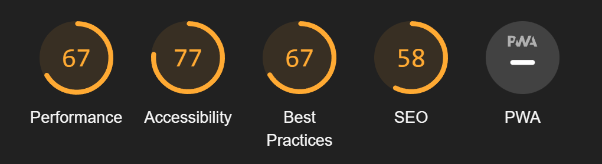  ||
|Add Product (admin) |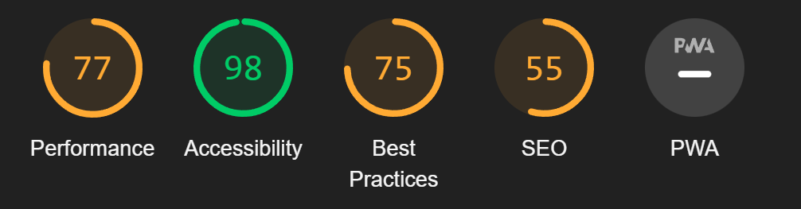  ||
| Edit Product (admin) |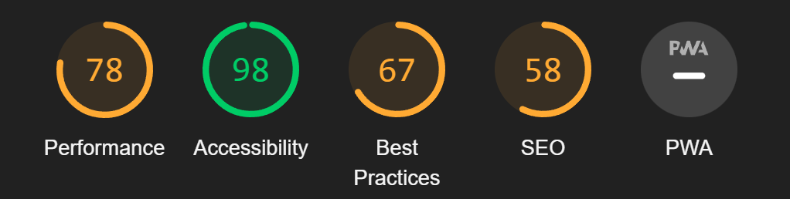 ||
| Shopping Bag | ||
| Checkout |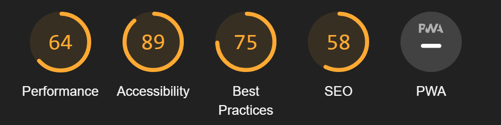 ||
| Order Success | 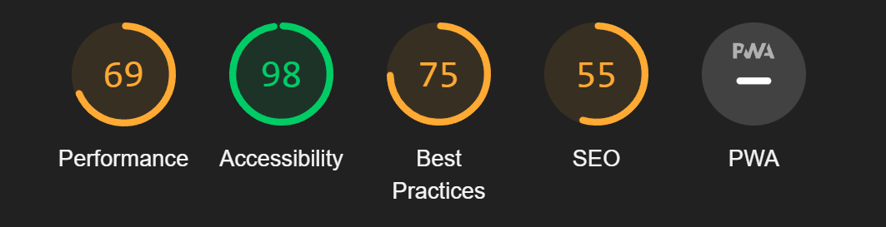||
|Contact Us|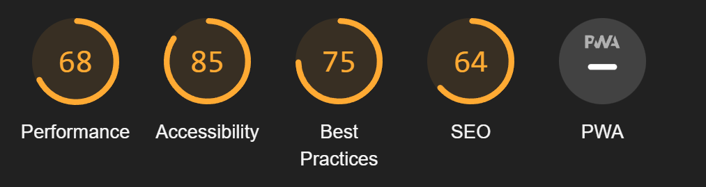 ||
|Poll|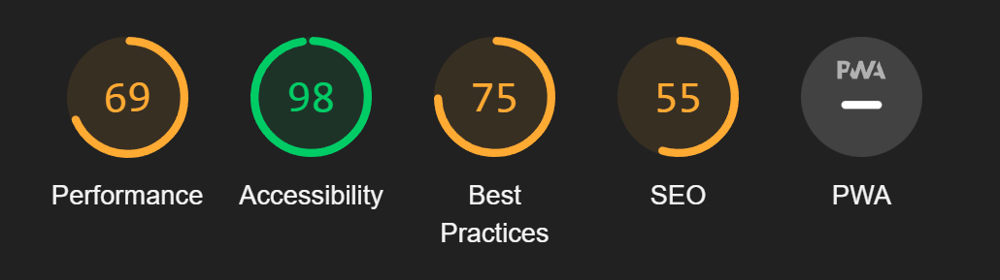 ||
|Poll Success| 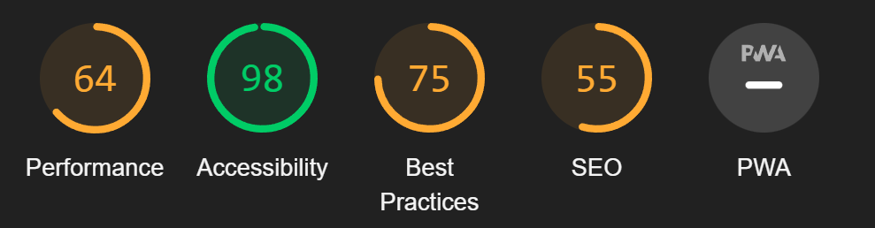|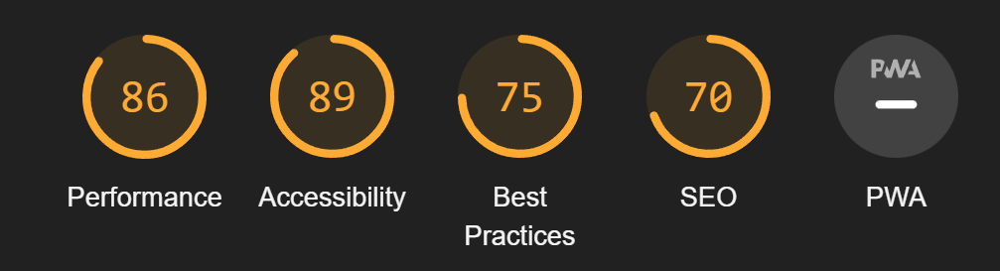|
|Poll Result| 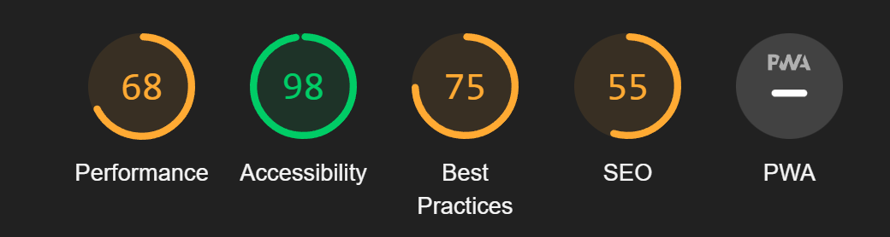|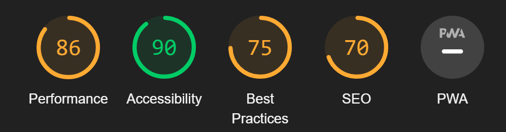|
|Poll Create |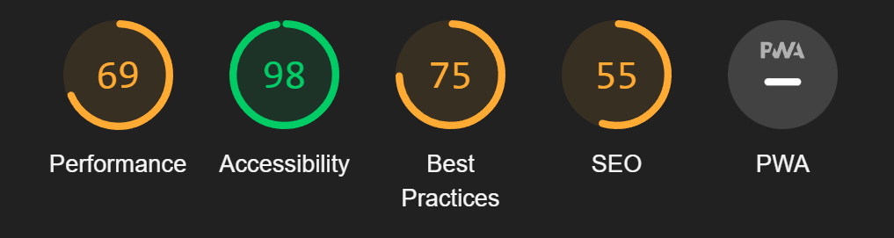|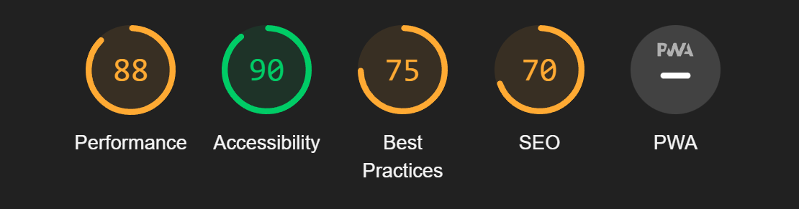|

## Responsiveness
[Am I Responsive?](http://ami.responsivedesign.is/#) was used to check responsiveness of the site pages across different devices.
 
 The site has been tested on various sizes such as those listed below.
 
 <strong>Mobile:</strong>
 375x667 / 360x740 / 412x915 / 414x896
 
 <strong>Tablet:</strong>
 768x1024 / 820x1180 / 912x1368 
 
<strong>Monitor:</strong>
 1280x1024 / 1600x900 / 2560x1440 / 3440x1440

  

## Manual Testing
Browser Compatibility:

Browser | Outcome | Pass/Fail 
 --- | --- | ---
Google Chrome | No appearance, responsiveness nor functionality issues.| Pass
Safari | No appearance, responsiveness nor functionality issues. | Pass
Microsoft Edge | No appearance, responsiveness nor functionality issues. | Pass
Firefox | No appearance, responsiveness nor functionality issues. | Pass

 

Device compatibility:

Device | Outcome | Pass/Fail
--- | --- | ---
Laptop | No appearance, responsiveness nor functionality issues. | Pass
ipad mini | No appearance, responsiveness nor functionality issues. | Pass
Lenovo M1 Tab | No appearance, responsiveness nor functionality issues. | Pass
Samsung s20 | No appearance, responsiveness nor functionality issues. | Pass
iphone 12 pro | No appearance, responsiveness nor functionality issues. | Pass

## Test cases
 ### Navigation Bar<strong> (Not logged in)</strong>
 
| Input | Output | Pass/Fail |
|--- | --- | --- |
|  Clicked on Logo in navigation bar. | It refreshed the page. | Pass
|  Clicked on the search bar in navigation bar. | It allowed me to type. | Pass
| Clicked on poll in navigation bar. | It went to the polls page. | Pass
| Clicked on my account in navigation bar.  | The dropdown list appeared of register and login .| Pass
| Clicked on the shopping bag in navigation bar. | It went to the shopping bag page. | Pass
|Clicked on all products| The dropdown list appeared | Pass |
|Clicked on DIY| The dropdown list appeared | Pass |
|Clicked on Food | The dropdown list appeared | Pass |
|Clicked on Melee | The dropdown list appeared | Pass |
|Clicked on Camping| The dropdown list appeared | Pass |
 
 ### Navigation Bar<strong> (Logged in)</strong>
 
| Input | Output | Pass/Fail |
|--- | --- | --- |
|  Clicked on Logo in navigation bar. | It refreshed the page. | Pass
|  Clicked on the search bar in navigation bar. | It allowed me to type. | Pass
| Clicked on poll in navigation bar. | The dropdown list of polls appeared. | Pass
| Clicked on my account in navigation bar.  | The dropdown list of logout and my profile appeared .| Pass
| Clicked on the shopping bag in navigation bar. | It went to the shopping bag page. | Pass
|Clicked on all products| The dropdown list appeared | Pass |
|Clicked on DIY| The dropdown list appeared | Pass |
|Clicked on Food | The dropdown list appeared | Pass |
|Clicked on Melee | The dropdown list appeared | Pass |
|Clicked on Camping| The dropdown list appeared | Pass |
 
### Navigation Bar<strong> (Admin Logged in)</strong>
| Input | Output | Pass/Fail |
|--- | --- | --- |
| Clicked on Logo in navigation bar. | It refreshed the page. | Pass
| Clicked on the search bar in navigation bar. | It allowed me to type. | Pass
| Clicked on poll in navigation bar. | The dropdown list of polls and create polls appeared. | Pass
| Clicked on my account in navigation bar.  | The dropdown list of logout, my profile, product management appeared .| Pass
| Clicked on the shopping bag in navigation bar. | It went to the shopping bag page. | Pass
|Clicked on all products| The dropdown list appeared | Pass |
|Clicked on DIY| The dropdown list appeared | Pass |
|Clicked on Food | The dropdown list appeared | Pass |
|Clicked on Melee | The dropdown list appeared | Pass |
|Clicked on Camping| The dropdown list appeared | Pass |
  
 ### Footer Bar
 
| Input | Output | Pass/Fail |
|--- | --- | --- |
|Clicked on the Subscribe Button | The MailChimp popup opens | Pass |
|Clicked on Contact Us |Brought to the contact us form| Pass |
|  Clicked on Instagram icon. | It opened Instagram in a new page.| Pass
|  Clicked on Facebook icon. | It opened the ecommerce facebook page in a new page.| Pass
|  Clicked on Github icon. | It opened my [github](https://github.com/eleanorbucke21). | Pass

 ### Index Page
 
- See Header and Footer section
 
 ### Register
 
| Input | Output | Pass/Fail |
|--- | --- | --- |
|  Can enter details to make an account. | Receive notification that confirmation email has been sent.  | Pass
|  Select login button. | Page goes to login page.  | Pass
 
 ### Login
 
| Input | Output | Pass/Fail |
|--- | --- | --- |
|  Can enter login details to account. | Receive notification that you have signed in.  | Pass
|  Select signup button. | Page goes to registration page.  | Pass
 
 ### Logout
 
| Input | Output | Pass/Fail |
|--- | --- | --- |
|  Select sign out button. | Receive notification that you have signed out.  | Pass
|  Select cancel button. | Return to index.  | Pass
 
 ### All Products <strong>(Not logged in)</strong>
 
| Input | Output | Pass/Fail |
|--- | --- | --- |
|  Can select any product to view. | Brings to product detail page.  | Pass
 
 ### All Products <strong>(Logged in as User)</strong>
 
| Input | Output | Pass/Fail |
|--- | --- | --- |
|  Can select any product to view. | Brings to product detail page.  | Pass
 
 ### All Products <strong>(Logged in as Admin)</strong>
 
| Input | Output | Pass/Fail |
|--- | --- | --- |
| Can select any product to view. | Brings to product detail page.  | Pass
|Can select edit under product | Brings you to edit product page | Pass|
|Can select delete a product | Deletes the product | Pass |
 
 ### Product Detail Page <strong>(Not Logged in)</strong>
 
| Input | Output | Pass/Fail |
|--- | --- | --- |
|  Select amount of product | The numbers will change.  | Pass
|  Can add product to basket. | Product goes into basket and you receive a notification.  | Pass
|  See the reviews. | Read the reviews.  | Pass
 
 ### Product Detail Page <strong>(Logged in)</strong>
 
| Input | Output | Pass/Fail |
|--- | --- | --- |
|  Select amount of product | The numbers will change.  | Pass
|  Can add product to basket. | Product goes into basket and you receive a notification.  | Pass
|  See the reviews. | Read the reviews.  | Pass
|  Wrote a review. | Review is posted.  | Pass
### Add Product Page
| Input | Output | Pass/Fail |
|--- | --- | --- |
| Add in Product Details | Details get added  | Pass |

### Edit Product Page
| Input | Output | Pass/Fail |
|--- | --- | --- |
|Edit a Products Details   | Products get edited| Pass|

### Bag Page
| Input | Output | Pass/Fail |
|--- | --- | --- |
| Can update amount of the products | Quantities get updated | Pass |
| Can remove product | Products get removed | Pass |
| Can select to go to checkout | Goes to checkout Page| Pass |

### Checkout Page
| Input | Output | Pass/Fail |
|--- | --- | --- |
|Can enter personal details and card details | Details get entered | Pass |
| Can select adjust bag | Brings back to bag view | Pass |
| When selecting complete order | A tenor gif appears while order being processed | Pass |
| When order is complete | Brought to the order success page | Pass |

### Order Success Page
| Input | Output | Pass/Fail |
|--- | --- | --- |
|Receive a notification| Notification received showing what email the order details are being sent to | Pass |
| Can see complete order | Complete order is viewable | Pass |
| Select button 'Checkout our Products' | Brings back to all products page | Pass |

### Contact Us Page
| Input | Output | Pass/Fail |
|--- | --- | --- |
|Can enter details and submit| Receive notification that the contact form has been submitted| Pass |

### Poll Page (not logged in)
| Input | Output | Pass/Fail |
|--- | --- | --- |
|Can view the polls| Can see the polls | Pass |
|On submission of choice in the polls | Brought to login page. |Pass|

### Poll Page (logged in)
| Input | Output | Pass/Fail |
|--- | --- | --- |
|Can view the polls| Can see the polls | Pass |
|Can select a choice in the polls | choice selected |Pass|
|Can submit choice in the polls| Brought to poll success page | Pass |

### Poll Success Page
| Input | Output | Pass/Fail |
|--- | --- | --- |
|Can select view results of poll |Brought to results page | Pass |

### Poll Result Page
| Input | Output | Pass/Fail |
|--- | --- | --- |
|Can view the results| Can see the results | Pass 

### Poll Create Page
| Input | Output | Pass/Fail |
|--- | --- | --- |
|Can create a poll |Can create a poll | Pass |
| On submission of poll | Notification shown that poll is under approval | Pass |

---
# Bugs

### Solved Bugs

| # | Bugs, Errors and Issues | Evidence |Solutions | Evidence of Solutions |
| --- | --- | --- |  --- | --- |
|1 | Pop Up would open when ever the page refreshed or went to new page | 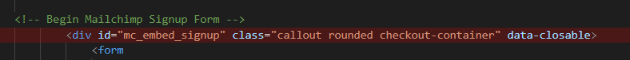 | solution was to change the display option | 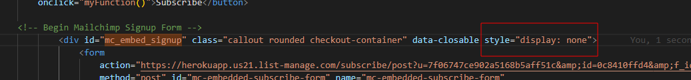 |

